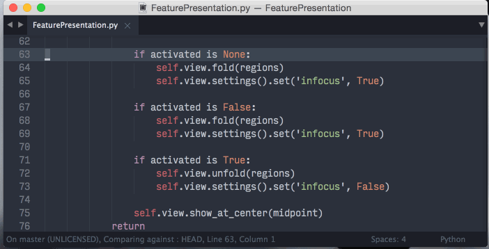

Feature Presentation
====================

While working with a large document, sometimes it's necessary to focus on a specific bit of text without any distractions. In the past, I would insert line breaks before and after the region I wanted to focus on, but that is both slow and sloppy.

Enter Feature Presentation.

This plugin allows you to focus on single portion of your document.  To activate Feature Presentation, select the portion of your document that you would like to isolate, and press a keyboard shortcut.

After editing, close the window and whatever change you made will be applied to your original document.

### Installation

Available on [Package Control](https://packagecontrol.io/packages/Feature%20Presentation)

After installation, add

    { "keys": ["alt+i"], "command": "feature_presentation" }

to your keybindings, changing `alt+i` to whatever you want.

### Basic mode

Basic mode, which folds the text around your selection instead of creating a new window, can be enabled by adding

    "fp_basic": true

to your user preferences.

### Bugs

None reported at this point. Check back later?

### Changelog
- **2018-08-05**: Fixed long overdue bugs with ST3! Thanks @ivans!
- **2015-04-15**: Cleaned up and simplified the code, squashed bugs.
- **2015-04-15**: Basic mode, which folds the text around your selection instead of creating a new window, can be enabled with `"fp_basic": true`
- **2015-04-14**: No longer relies on cold folding, so you can't accidentally delete most of your document. When activated, the selected text will load into a new view. When you close this view the changes will be reflected in your original document.
